# `@use-pico/cls`

<a id="introduction"></a>
## Introduction ✨

`@use-pico/cls` is a class-first styling system built for modern design systems and production apps. It works with existing CSS utilities (like Tailwind), _not_ CSS-in-JS. Its core ideas are: **design tokens** as first‑class citizens, **multi-slot** components, **explicit variants** with strong TypeScript guarantees, and a powerful **multi-level inheritance** model for scalable systems. ✨

- 🧱 **Contracts, not configs**: declare **tokens · slots · variants** once → get full IntelliSense everywhere
- 🎯 **Design tokens** as first-class citizens with **inheritance** and validation
- 🎛️ **Rules that read like UI**: map variant combos → slot styles with predictable overrides
- 🧩 **Extend anything**: multi‑level inheritance across tokens/slots/variants with types intact
- 🧠 **Type-safety first**: compile‑time checks across contracts, rules, and overrides
- ⚡️ **Lazy by default**: slots are computed on demand via Proxy; no wasted work
- 🚀 **Cached slots**: per-slot memoization; repeated `slot()` calls with identical inputs are near‑zero cost
- 🎨 **Runtime flexibility**: override variants/slots/tokens at `create()` time
- 🌀 **Tailwind‑native**: powered by `tailwind-merge` for sane, deduped class strings
- 📦 **Built for production**: framework‑agnostic, tiny runtime, excellent React integration
- 🧭 **Where this fits**: honest comparison with CVA, TV, Stitches, and vanilla-extract

> **Who is this for**: teams building design systems, component libraries, and apps that want predictable styling with a friendly, type-safe developer experience. 🎯

> **Note**: `cls` is not `CSS‑in‑JS`; it returns class strings and works with your existing CSS (e.g., Tailwind). No runtime style injection. 🚫

## Table of Contents 🧭
<a id="toc"></a>

- [Introduction](#introduction)
- [Chapter 1. Foundations](#chapter-1)
  - [1.1 What is `@use-pico/cls`?](#1-1-what-is)
  - [1.2 Motivation](#1-2-motivation)
  - [1.3 Install & Quick Start](#1-3-install-quick-start)
  - [1.4 Mental model: contracts, tokens, slots, variants](#1-4-mental-model)
  - [1.5 How it works (at a glance)](#1-5-how-it-works)
  - [1.6 Performance](#1-6-performance)
  
- [Chapter 2. Core API](#chapter-2)
  - [2.1 `cls(contract, definition)`](#2-1-cls)
  - [2.2 `create(options)`](#2-2-create)
  - [2.3 `extend(contract, definition)`](#2-3-extend)
  - [2.4 `use(sub)`](#2-4-use)
  - [2.5 `merge(a, b)`](#2-5-merge)
  - [2.6 `tvc(...classes)`](#2-6-tvc)
  
- [Chapter 3. Rules & Precedence](#chapter-3)
  - [3.1 `rules` callback: helpers and intent](#3-1-rules-callback)
  - [3.2 Precedence: who wins and when](#3-2-precedence)
  - [3.3 Slots and per-variant targeting](#3-3-slots-variant-targeting)
  
- [Chapter 4. Tokens, Variants, Slots](#chapter-4)
  - [4.1 Tokens](#4-1-tokens)
  - [4.2 Variants](#4-2-variants)
  - [4.3 Slots](#4-3-slots)
  - [4.4 Create-time overrides](#4-4-create-time-overrides)
  
- [Chapter 5. Inheritance System](#chapter-5)
  - [5.1 Overview](#5-1-overview)
  - [5.2 Inheritance rules (authoritative)](#5-2-inheritance-rules)
  - [5.3 Method peek (where it hooks into the API)](#5-3-method-peek)
  - [5.4 No‑code patterns](#5-4-no-code-patterns)
  - [5.5 Notes and guidance](#5-5-notes)
  - [5.6 Resolution flow (diagram)](#5-6-diagram)

---

<a id="chapter-1"></a>
## Chapter 1. Foundations 🏗️

<a id="1-1-what-is"></a>
### 1.1 What is `@use-pico/cls`? ❓

A class-based styling library that uses your existing CSS classes (e.g., Tailwind). It is _not_ CSS‑in‑JS. You declare a **contract** (tokens, slots, variants), provide a **definition** (token values, rules, defaults), and get lazily computed class functions for every slot. The system emphasizes **type safety**, **explicitness**, and **scalable inheritance**. 💡

- 🎨 **Not Tailwind-bound**, but designed to work great with it
- 🛡️ **TypeScript-first**: contracts and definitions are validated at compile time
- 🧮 **Predictable merging**: last-wins and deduplication via tailwind-merge

<a id="1-2-motivation"></a>
### 1.2 Motivation 💫

Why another styling library? Because as projects grow, the tiny decisions add up: a class swapped here, a variant misspelled there, a theme forked “just for now”. After a while, you can’t tell what wins, or why.

- **Fewer surprises**: types flag the “did you mean...?” moments before you hit save.
- **Clear order of operations**: the same inputs always lead to the same classes.
- **Grows with you**: inheritance means you can add layers without losing your footing.
- **Feels like the UI**: rules read like the component you’re styling.
- **Theme without branching**: change tokens, not components.
- **Compose without fear**: `use(sub)` lets you plug pieces together safely.
- **Fits real React code**: `useCls` and `withCls` work with common file and export patterns.

_Net effect: fewer “how did we get here?” moments, more time shipping UI you can trust._

<a id="1-4-mental-model"></a>
### 1.4 Mental model: contracts, tokens, slots, variants 🧠

- 📦 **Contract**: structure of a module
  - 🎨 **tokens**: named groups with values (e.g., `color.bg`: [`default`, `hover`]) used as semantic building blocks
  - 🧩 **slot**: parts of a component (e.g., `root`, `label`, `icon`) that each return a class string
  - 🎚️ **variant**: typed switches that alter appearance (e.g., `size`: [`sm`,`md`,`lg`], `loading`: [`bool`])
- 🛠️ **Definition**: concrete values and behavior
  - 🎯 **token**: map each token value to classes
  - 📐 **rules**: `root(...)` for base styling; `rule(match, ...)` for variant-driven deltas
  - 📌 **defaults**: required per layer to keep a single source of truth
- 🛎️ **Create-time overrides**: safely tweak a single instance (`variant`/`slot`/`override`/`token`) with clear precedence
- 🧬 **Inheritance**: `extend(...)` adds or overrides tokens/slots/variants while keeping types correct end-to-end

**Why explicit defaults**: each layer (base, child, grandchild) restates defaults so you always see the current truth in one place, which is essential in long chains. 👉 This keeps surprises low and readability high.

<a id="1-3-install-quick-start"></a>
### 1.3 Install & Quick Start 🚀

**Install**: 🚀

```bash
npm i @use-pico/cls
# or
pnpm add @use-pico/cls
# or
bun add @use-pico/cls
```

**Minimal example**: ✨

```ts
import { cls } from "@use-pico/cls";

// Contract + definition
const Button = cls(
  {
    tokens: {},
    slot: ["root"],
    variant: { size: ["sm", "md"], intent: ["primary", "neutral"] },
  },
  {
    token: {},
    rules: ({ root, rule, classes }) => [
      // Base styling
      root({ root: classes(["inline-flex", "items-center", "rounded"]) }),
      // Variant deltas
      rule({ size: "sm" }, { root: classes(["px-2", "py-1", "text-sm"]) }),
      rule({ size: "md" }, { root: classes(["px-4", "py-2", "text-base"]) }),
      rule({ intent: "primary" }, { root: classes(["bg-blue-600", "text-white"]) }),
    ],
    defaults: { size: "md", intent: "neutral" },
  },
);

// Usage
const a = Button.create();
a.root(); // "inline-flex items-center rounded px-4 py-2 text-base"

const b = Button.create({ variant: { size: "sm", intent: "primary" } });
b.root(); // "inline-flex items-center rounded px-2 py-1 text-sm bg-blue-600 text-white"
```

> **What to expect next**: ➡️ Chapter 2 covers the core API (`cls`, `extend`, `create`, `merge`, `use`, `tvc`). Chapter 3 explains the rule helpers and precedence. Then we dive into tokens, variants, slots, and inheritance, followed by React integration, theming, and recipes.

<a id="1-5-how-it-works"></a>
### 1.5 How it works (at a glance) 🧭

- You describe a component’s shape with a **contract** (tokens · slots · variants).
- You provide concrete **definitions** (token classes, rules, defaults).
- At `create()` time, the library walks the rules, applies matches, and builds class strings per slot.
- **Variants can target specific slots**: rules apply per-slot, so a variant can tweak `label` without touching `root`, and vice‑versa.
- Classes are deduped and normalized so that “last wins” is consistent.

> **Note**: under the hood `cls` uses `tailwind-merge` for class string merging. `tvc` is exposed as a direct re-export for when you need it.

<a id="1-6-performance"></a>
### 1.6 Performance ⚡️

High-level, work is split between the one-time `create()` call and each `slot()` call.

- **`create()` cost (one-time per instance)**
  - Walks the inheritance chain to build indexes (tokens, rules, defaults, slots).
  - Computes a token lookup table with correct replace/append semantics.
  - Gathers all rules from every layer. No slot classes are generated yet.
  - Complexity roughly scales with: number of layers, tokens, rules, and slots.

- **`slot()` cost (per call)**
  - Merges effective variants (defaults → `create().variant` → per-call overrides).
  - Scans the full rule list, checks matches, and applies only the entries for this slot.
  - Resolves any referenced tokens via the precomputed token table (cheap lookups).
  - Applies `slot` appends and `override` hard overrides from `create()` options.
  - Runs `tailwind-merge` at the end to normalize/dedupe class strings.
  - Dominant work here is “iterate rules + merge classes”. The `tvc` pass is linear in class count.
  - ⚡️ **Memoized per slot**: results are cached by variant overrides; repeated calls with the same input are near‑zero cost.

Practical guidance:

- **Prefer calling `create()` once per render** and then use many `slot()` calls. `create()` does more upfront work; `slot()` does the cheaper per-slot computation.
- **In loops**, avoid `create()` inside the tightest loop unless variants truly differ per item. If they do, it’s expected but that’s where cost concentrates.
- **Know the cache model**: each `slot()` has its own cache, and each `create()` call creates fresh slot functions (with fresh caches). Repeated calls with identical inputs are extremely fast.
- **Keep rules purposeful**: many tiny rules are fine, but remember each `slot()` scans the list. Coarser rules or fewer combinations reduce per-call work.
- **Tokens are inexpensive**: token classes are fetched from a prebuilt map; using tokens does not add significant overhead.

> **Note**: class normalization uses `tailwind-merge` (exposed as `tvc`). There’s no extra layer on top — it’s a direct re-export.

---

<a id="chapter-2"></a>
## Chapter 2. Core API 🔧

This is the quick map of the surface area you’ll use daily.

<a id="2-1-cls"></a>
### 2.1 `cls(contract, definition)`

- **What it does**: creates a `cls` instance from a contract and definition.
- **Returns**: an object with `create()`, `extend()`, `use()`, and `contract`.
- **Contract**: `{ tokens, slot, variant }` describe structure.
- **Definition**: `{ token, rules, defaults }` provide values and behavior.

```ts
import { cls } from "@use-pico/cls";

const Button = cls({ /* contract */ }, { /* definition */ });
```

<a id="2-2-create"></a>
### 2.2 `create(options)`

- **What it does**: resolves classes for each slot using defaults + your overrides.
- **Options**: `{ variant?, slot?, override?, token? }`.
- **Precedence**: base → variant rules → slot appends → hard overrides.

```ts
const b = Button.create({ variant: { size: "sm" } });
b.root();
```

<a id="2-3-extend"></a>
### 2.3 `extend(contract, definition)`

- **What it does**: creates a derived `cls` with added/overridden tokens/slots/variants.
- **Why**: build a lineage (e.g., `Button` → `PrimaryButton` → `IconButton`).
- **Types stay intact** across generations.

```ts
const PrimaryButton = Button.extend({ /* contract delta */ }, { /* definition delta */ });
```

<a id="2-4-use"></a>
### 2.4 `use(sub)`

- **What it does**: narrows a `cls` to a specific derived subtype for composition.
- **Why**: safely plug a child `cls` where a parent shape is expected (React composition, etc.).

```ts
function Toolbar({ button }: { button: ReturnType<typeof Button.use<typeof PrimaryButton>> }) { /* ... */ }
```

<a id="2-5-merge"></a>
### 2.5 `merge(a, b)`

- **What it does**: pre-compose two `create()` configs; later values win.
- **Use case**: library defaults + app overrides merged into a single options object.

```ts
import { merge } from "@use-pico/cls";
const opts = merge({ variant: { size: "sm" } }, { variant: { intent: "primary" } });
Button.create(opts);
```

<a id="2-6-tvc"></a>
### 2.6 `tvc(...classes)`

- **What it is**: a direct re-export of `tailwind-merge` with no alterations.
- **Why**: normalize/dedupe classes when you must concatenate manually.

```ts
import { tvc } from "@use-pico/cls";
const clsName = tvc("px-2 px-4", "text-sm"); // "px-4 text-sm"
```
 
---

<a id="chapter-3"></a>
## Chapter 3. Rules & Precedence 🎛️

<a id="3-1-rules-callback"></a>
### 3.1 `rules` callback: helpers and intent

The `rules` callback is where you describe styling in small, readable steps. It returns an array of steps created by helper functions:

- **`root(slotMap, override?)`**: base styles; `override: true` clears classes collected so far for targeted slots.
- **`rule(match, slotMap, override?)`**: conditional styles applied when `match` (e.g., `{ size: "sm" }`) is satisfied.
- **`classes(className, tokens?)`**: ergonomic helper to supply `class` and optional `token` together.

> **Intent**: keep rule authoring simple, make variant intent obvious, and let types guide you to valid slots/tokens/variants.

<a id="3-2-precedence"></a>
### 3.2 Precedence: who wins and when

From lowest to highest within a single `create()` call:

1. Base `root(...)` rules
2. Matching `rule(...)` steps (in authoring order)
3. `slot` appends from `create({ slot: ... })`
4. `override` hard overrides from `create({ override: ... })` or `root/ rule` with `override: true`
5. Final class normalization via `tvc`

Across inheritance layers, parent rules run first, then child rules, etc., preserving author order per layer.

<a id="3-3-slots-variant-targeting"></a>
### 3.3 Slots and per-variant targeting

Every rule targets a map of slots. That means variants can adjust individual slots without affecting others.

Examples in words:

- “When `size` is `sm`, make `root` padding smaller; leave `label` alone.”
- “When `intent` is `primary`, apply `color` tokens to `root` and add weight to `label`.”

This keeps styling changes local and predictable, and mirrors how components are structured.

---

<a id="chapter-4"></a>
## Chapter 4. Tokens, Variants, Slots 🎨

<a id="4-1-tokens"></a>
### 4.1 Tokens

- **What**: semantic class lists referenced by name (e.g., `color.text.default`).
- **Why**: change themes without editing rules; reuse across components.
- **Where**: declared in `contract.tokens`, values provided in `definition.token`.
- **Inheritance semantics**: if a child contract re-declares a token value, that value is a *REPLACE*; otherwise the child *APPENDS*.
- **Create-time overrides**: `create({ token: { group: { value: ["...classes"] } } })` replaces that token’s class list for the instance.

<a id="4-2-variants"></a>
### 4.2 Variants

- **What**: typed switches (e.g., `size: ["sm","md","lg"]`, `disabled: ["bool"]`).
- **Defaults**: each layer declares `defaults`; later layers can change them.
- **Use in rules**: `rule({ size: "sm" }, ...)` or `rule({ disabled: true }, ...)`.
- **Merging**: variant domains union across inheritance; defaults follow last layer.

<a id="4-3-slots"></a>
### 4.3 Slots

- **What**: named parts of a component (e.g., `root`, `label`, `icon`). Each slot returns a class string.
- **Rules target slots**: pass a slot map to `root(...)`/`rule(...)`.
- **Usage**: `const c = Button.create(); c.root(); c.label();`
- **Composition**: using slots makes partial overrides ergonomic at `create()` time.

<a id="4-4-create-time-overrides"></a>
### 4.4 Create-time overrides

- **variant**: set or change variant values for an instance.
- **slot**: append to specific slot classes after rules.
- **override**: hard replace a slot’s classes, ignoring earlier steps.
- **token**: replace selected token values for this instance.
- **Order**: base → rules → slot → override; tokens resolve where referenced.

---

<a id="chapter-5"></a>
## Chapter 5. Inheritance System 🧬

<a id="5-1-overview"></a>
### 5.1 Overview

Inheritance lets you stack intent across layers: `Base` → `Child` → `Grandchild`. Each layer can add tokens, slots, variants, rules, and adjust defaults — while preserving types.

> Use cases: platform theming, product skins, brand variations, component specializations.

<a id="5-2-inheritance-rules"></a>
### 5.2 Inheritance rules (authoritative)

- **Evaluation order**: parent rules run first, then children — preserving each layer’s authoring order.
- **Tokens**:
  - If a child contract re‑declares a token value, that value is a REPLACE at that layer.
  - If not re‑declared, the child APPENDS classes to that token value.
  - Create-time token overrides always replace just the specified values for the instance.
- **Variants**:
  - Domains merge by union across layers (you can add new values in children).
  - Defaults are re-stated each layer; last layer wins for the instance’s base.
- **Slots**:
  - The slot list is the union of all layers.
  - Rules can target any slot present in the union.
- **Rules**:
  - Collected from each layer in order: parent → child → grandchild.
  - Authoring order within each layer is preserved.
  - `override: true` in a rule step clears classes collected so far for targeted slots.
- **Create-time precedence** (per slot): base → rules → slot appends → hard overrides.

<a id="5-3-method-peek"></a>
### 5.3 Method peek (where it hooks into the API)

Cross-link: see [2.3 `extend(contract, definition)`](#2-3-extend) and [2.4 `use(sub)`](#2-4-use).

- **`extend(...)`** wires the inheritance chain by storing references to parent contract and definition. When you later call `create()`, the library walks this chain to build the combined indexes (tokens, rules, defaults, slots) in parent→child order.
- **`use(sub)`** lets you assign a derived `cls` where a parent shape is expected — a safe, typed narrowing for composition.

> Think of `extend` as building the family tree, and `create()` as reading it top-to-bottom at call time.

<a id="5-4-no-code-patterns"></a>
### 5.4 No‑code patterns

Common real-life hierarchies you can model without changing code structure:

- **Branding**: `BaseButton` → `BrandButton` (tokens override colors) → `CampaignButton` (rules adjust prominence).
- **Product tiers**: `BaseCard` → `ProCard` → `EnterpriseCard` (variants added per tier; defaults differ).
- **Platform skins**: `BaseInput` → `MobileInput` (slot spacing) → `iOSInput` (token tweaks).

Guidance:

- Prefer token changes for theme/brand differences; reach for rules when layout or structure changes.
- Keep every layer’s `defaults` explicit for quick auditing.
- Avoid duplicating parent rules; add small deltas instead.

<a id="5-5-notes"></a>
### 5.5 Notes and guidance

- Re-state defaults at each layer so intent is visible where you read.
- Prefer tokens for theme-like differences; prefer rules for structural differences.
- Keep child layers focused: add/override what you need; avoid duplicating parent rules.

<a id="5-6-diagram"></a>
### 5.6 Resolution flow (diagram)

```mermaid
flowchart TD
  A["Contract (per layer)<br/>- tokens<br/>- slots<br/>- variants"] --> B["Definition (per layer)<br/>- token classes<br/>- rules<br/>- defaults"]
  B --> C["extend(...) chain<br/>parent → child → grandchild"]
  C --> D["create(options)<br/>- variant<br/>- slot<br/>- override<br/>- token"]
  D --> E["Build indexes<br/>- merged defaults<br/>- token lookup (REPLACE/APPEND)<br/>- collected rules<br/>- union of slots"]
  E --> F["For each slot() call<br/>merge effective variants<br/>scan rules, apply matches<br/>resolve tokens → classes<br/>apply slot/override deltas"]
  F --> G["tvc() normalize/dedupe<br/>return final class string"]

  subgraph Inheritance
    A -->|per layer| B
    B -->|collect| E
  end

  style G stroke:#4c1,stroke-width:2px
  style F stroke:#06c,stroke-width:2px
  style E stroke:#06c,stroke-width:2px
  style D stroke:#333,stroke-dasharray: 3 3
```


